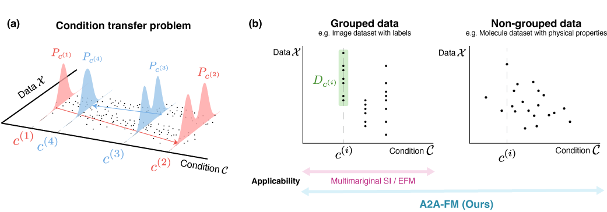

<h1 align="center">All-to-All Flow-based Transfer model (A2A-FM) </h1> 
<p align="center">
  <a href="https://kotatumuri-room.github.io/">Kotaro Ikeda</a>
  ·
  Masanori Koyama
  ·
  Jinzhe Zhang
   ·
  Kohei Hayashi
   ·
   <a href="https://www.ism.ac.jp/~fukumizu/">Kenji Fukumizu</a>
</p>
  <h3 align="center">  <a href="https://arxiv.org/abs/2504.03188">[arXiv]</a>  </h3>
  <h2 align="center"> NeurIPS2025 (Poster)</h3>
<p align="center">
  
</p>


This repository contains instructions for running the traning and evaluations demonstrated in the paper "Pairwise Optimal Transports for Training All-to-All Flow-Based Condition Transfer Model"
# Requirements
This code was developed and tested on Python 3.11.

Other requirements are in `requirements.txt`. To install the dependencies, run the following command.
```bash
pip install -r requirements.txt
git clone https://github.com/terraytherapeutics/COATI-LDM.git
mv requirements_coati_ldm.txt ./COATI-LDM/requirements.txt # needed to adjust the package versions with this code
pip install ./COATI-LDM
```

# Data preparation
Read the `README.md` files under `autoencoder_ckpts`, `data`, and `datasets` if you want to train/evaluate the drug transfer task or the CelabADialogHQ task.

This is unneccessary if you only want to run synthetic experiments.

# Experiments

## 1. Synthetic experiment on grouped data (Figure 3(a))
The code used for Figure 3(a) is found at [`figure_notebooks/draw_synthetic_grouped.ipynb`](figure_notebooks/draw_synthetic_grouped.ipynb)

## 2. Synthetic experiment on non-grouped data (Figure 3 (b))
To reproduce this experiment, you first need to train the models.
```bash
# train A2AFM 
python main.py --config-name=synthetic

# train DDPM + CFG for parital diffusion
python main.py --config-name=synthetic_diff_cfg

# train Multimarginal SI
python stochastic_intepolants_train.py --config-name=synthetic
```
Once you get the checkpoint files (inside `./outputs` by default), write the path to `.ckpt` files in [`figure_notebooks/draw_synthetic_nongrouped.ipynb`](figure_notebooks/draw_synthetic_nongrouped.ipynb) to reproduce the evaluation results.

## 3. QED experiment (Figure 4 & Table 2)
```bash
# train A2A-FM
python main.py --config-name=zinc22_qed
# evaluate
python eval.py --config-name=zinc22_qed ckpt_dir=<path to .ckpt>
```

## 4. LogP-TPSA experiment (Figure 5 & Table 3)
```bash
# A2A-FM
python main.py --config-name=zinc22_logp_tpsa
python eval.py --config-name=zinc22_logp_tpsa ckpt_dir=<path to .ckpt>
# Partial diffusion with classifer-free guidance (T=300)
python main.py --config-name=zinc22_logp_tpsa_guidance_diffusion
python eval.py --config-name=zinc22_logp_tpsa_guidance_diffusion evaluator.timesteps_eval=0.3 ckpt_dir=<path to .ckpt>
# Partial diffusion with classifer-free guidance (T=500)
python main.py --config-name=zinc22_logp_tpsa_guidance_diffusion
python eval.py --config-name=zinc22_logp_tpsa_guidance_diffusion evaluator.timesteps_eval=0.5 ckpt_dir=<path to .ckpt>
# Partial diffusion with classifer-free guidance (T=1000)
python main.py --config-name=zinc22_logp_tpsa_guidance_diffusion
python eval.py --config-name=zinc22_logp_tpsa_guidance_diffusion evaluator.timesteps_eval=1.0 ckpt_dir=<path to .ckpt>
# OTCFM
python main.py --config-name=zinc22_logp_tpsa_otcfm 
python eval.py --config-name=zinc22_logp_tpsa_otcfm ckpt_dir=<path to .ckpt>
# SI(K=10)
python stochastic_interpolants_train.py --config-name=zinc22_logp_tpsa
python stochastic_interpolants_evaluate_drug.py --config-name=zinc22_logp_tpsa 
```

## 5. CelebADialogHQ (Appendix C)

```bash 
python main.py --config-name=celebahq_smile_beard
python eval.py --config-name=celebahq_smile_beard ckpt_dir=<path to .ckpt>
```
